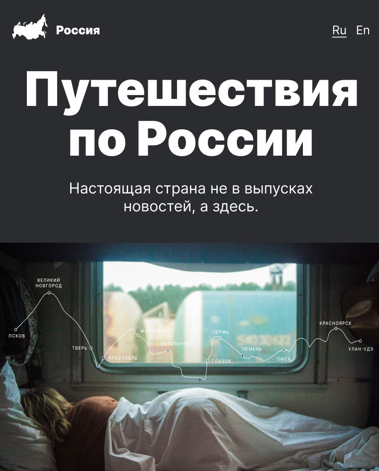

# Путешествия по России
Одностраничный сайт об интересных местах в России

## Технологии
- **HTML** - добрый надежный язык гипертекстовой разметки 📋
- **CSS** - каскадные таблицы стилей для описания незабываемого дизайна веб-сайта ✨

## Особенности разработки
- **Grid** для резиновой верстки
- **Медиазапросы** для адаптивной верстки
- **Методология БЭМ** для грамотной разработки интерфейса

## Будущие улучшения
1. Кроссбраузерная поддержка 🔜
